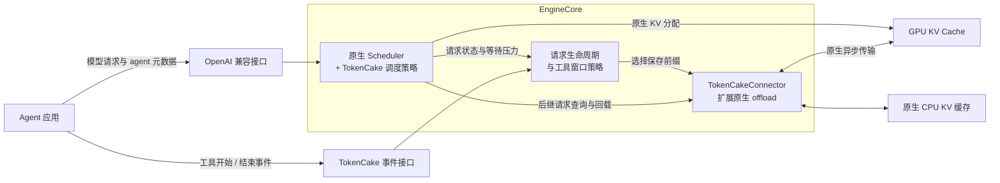

# TokenCake：面向多轮 agent 的 vLLM 调度与 KV 复用优化

TokenCake 在 vLLM 上增加对 agent 工作流的调度支持。一次 agent 任务通常包含多次模型调用，调用之间穿插工具执行；后续调用会重复携带不断增长的历史上下文。多个 agent 并发时，执行顺序、后续 KV 容量需求，以及工具等待期间能否保住已有前缀，都会影响整个任务的完成时间。

当前实现围绕两条路径优化：

1. 在 GPU 容量范围内安排更合适的请求执行，减少抢占；
2. 在工具等待期间将可复用 KV 保存到 CPU，减少后继调用的输入计算。

已完成的实验中，静态图 agent 负载的总完成时间相对原生 vLLM 降低 **22.71%～34.22%**；SWE-bench Verified coding agent 测试中，输出吞吐提高 **27.6%**

## 比较对象与共同设置

本文主要比较本次实验中的原生 vLLM（`base`）与当前 TokenCake 组合配置（`agent_offload`）。

- 组件对比中的 `agent` 表示仅启用 TokenCake 调度，`offload` 表示仅启用工具窗口 KV 保存。
- 原生基准来自 vLLM 0.22.0，已经开启 **GPU 前缀缓存、分块 prefill、异步调度和完整输入长度检查**。
- TokenCake 在此基础上增加调度策略，并使用 **100 GiB CPU KV 缓存容量**。

| 环节 | 实验中的原生 vLLM | 当前 TokenCake |
| ------------ | ------------------------------------------------------------ | ------------------------------------------------------------ |
| 新请求准入 | 检查完整输入是否能放进当前空闲容量 | 先扣除已接纳请求尚未分配的增长需求，再检查新请求的完整输入与最大输出预算 |
| 等待顺序 | FCFS，按到达顺序 | 根据 agent 重要性和 DAG 信息排序，兼顾分支汇合与活跃 GPU 前缀共享 |
| 容量份额 | 没有 TokenCake 的 agent 分类预留 | 按 agent 类型动态预留，允许借用闲置份额 |
| 物理容量不足 | 按原生运行队列规则选择抢占对象 | 在重要性相近的候选中考虑实际释放量、恢复计算成本和完成进度 |
| 工具等待期间 | 已释放的 GPU 前缀可能被其他请求覆盖；本次基准未启用 CPU KV 保存 | 满足收益条件时保存到 CPU，后继调用命中后恢复 |
| prefill 分块 | 使用原生批处理预算 | 沿用原生分块与预算 |

两类实验使用相同的模型和以下服务设置；每项对比内部保持相同任务集合与初始输入。

| 项目 | 设置 |
| --------------------- | ------------------------------------------------ |
| 模型 | Qwen2.5-14B-Instruct，BF16 |
| 单组 GPU | A800-SXM4-80GB，TP=1、PP=1 |
| 显存比例 / 最大上下文 | 0.5 / 32,768 token |
| GPU KV 池 | 两组均为 3,050 block，16 token/block |
| 整批 token 预算 | 8,192，保留原生分块 prefill |
| CPU KV 容量 | 原生与仅调度组未启用；仅保存与组合组配置 100 GiB |

vLLM 本身提供 CPU offload 基础设施，TokenCake 复用它并增加工具事件驱动的保存与保留策略。本次结果包含额外 CPU 缓存带来的收益。

## 静态图 agent 优化

### 工作负载与测量范围

固定各角色之间的有向无环依赖图（DAG），覆盖规划、并行代码生成、审查、修复和分支汇合。每次运行包含 **24 个完整 DAG、648 次模型调用、155,136 个输出 token**；每个 DAG 有 29 个执行节点和 36 条依赖边。

1. 图结构、初始输入、输出预算和工具等待时间预先确定。
2. 模型执行真实生成，后继调用追加实际生成历史，汇合时保留一份共同前缀。
3. 工具阶段使用固定结果和模拟等待。

应用按 0.05、0.1、0.2、0.5、1.0 QPS 等间隔到达，同一 QPS 下各配置使用相同到达序列与完整工作量。

测量指标：

- **总 E2E** 是整批 DAG 从客户端启动到全部完成的墙钟时间，包含到达间隔、模型调用和工具等待。
- **应用 P95** 是单个 DAG 从开始执行到完成的耗时的第 95 百分位。

### 完成时间与尾延迟

下表时间单位为秒，E2E 降幅按 `1 - TokenCake / 原生 vLLM` 计算。

| 应用 QPS | 原生总 E2E | TokenCake 总 E2E | E2E 降低 | 原生应用 P95 | TokenCake 应用 P95 |
| -------- | ---------: | ---------------: | ---------: | -----------: | -----------------: |
| 0.05 | 875.74 | **676.86** | **22.71%** | 455.96 | **252.14** |
| 0.1 | 940.76 | **671.28** | **28.65%** | 725.33 | **449.19** |
| 0.2 | 938.79 | **640.45** | **31.78%** | 821.64 | **520.62** |
| 0.5 | 938.99 | **648.05** | **30.98%** | 883.84 | **598.34** |
| 1.0 | 960.44 | **631.77** | **34.22%** | 929.12 | **604.50** |

五档负载的总 E2E 和应用 P95 均改善。QPS 1.0 下，总 E2E 降低 **34.22%**，应用 P95 降低 **34.94%**。QPS 0.05 下，最后一个 DAG 到第 460 秒才到达，到达时间占据较大比例，因此减少模型计算和排队对整批时间的影响较小。

QPS 0.05、0.1 的原生和组合配置各运行三次，其余配置与 QPS 组合各运行一次；表格按每项指标的中位数汇总。这是有限批次结果，重复次数也有限，不能直接推算持续到达时的最大服务能力。

### 收益来自哪里：更多输入复用，更少抢占与排队

QPS 1.0 下，输入可以分成三部分：直接复用 GPU 前缀、从 CPU 回载 KV，以及需要执行 prefill 计算的剩余输入。下表按**每次模型调用首次处理输入**统计，不包含同一次调用被抢占后重复执行的 prefill。

| 指标 | 原生 vLLM | TokenCake | 变化 |
| ----------------------------- | --------------: | ------------------: | ----------------------- |
| 首次输入处理的 prefill 计算量 | 3,282,597 token | **952,780 token** | **减少 70.97%** |
| GPU 前缀命中 | 2,591,264 token | **3,193,296 token** | 增加 23.23% |
| CPU KV 命中 | 0 | **1,726,736 token** | 后继输入从 CPU 恢复 |
| 输入缓存复用比例 | 44.12% | **83.78%** | **增加 39.66 个百分点** |
| 总抢占次数 | 41 | **0** | 本次组合运行未发生抢占 |
| 平均请求排队 | 62.97 秒 | **28.78 秒** | **缩短 54.29%** |

输入缓存复用比例为 `(GPU 命中 token + CPU 命中 token) / 完整输入 token`，分母包含上述三种来源。后继输入来自各次实际生成，因此各组输入总量略有差异；输出总量和 DAG 工作量保持一致。

这些指标与优化路径相对应：工具窗口保存让原本可能丢失的前缀继续可用，减少后继输入计算；排序增加活跃 GPU 前缀共享，减少新增 KV 需求；准入时持续计入后续增长，减少请求已经执行后再被抢占的情况。较少的输入计算与抢占同时伴随更短的排队，最终缩短整个 DAG 的完成时间。

启用调度的 14 次运行均未发生抢占，对应实际重复计算 token 也为 0。原生与仅保存配置缺少同口径的实际重算观测，所以 **70.97% 是首次输入 prefill 计算量的降幅，不能表述为全部重复计算量降低 70.97%**。

### 组件贡献与缓存成本

在 QPS 1.0 下，分别开启两个组件得到以下结果：

| 配置 | 总 E2E | 相对原生降低 | 首次 prefill 计算 token | 抢占次数 |
| --------------------------- | ------------: | -----------: | ----------------------: | -------: |
| 原生 vLLM（`base`） | 960.44 秒 | — | 3,282,597 | 41 |
| 仅调度（`agent`） | 837.78 秒 | **12.77%** | 2,705,768 | 0 |
| 仅工具窗口保存（`offload`） | 691.01 秒 | **28.05%** | 1,039,577 | 58 |
| 组合（`agent_offload`） | **631.77 秒** | **34.22%** | **952,780** | **0** |

**这一静态图负载中，仅启用工具窗口保存已取得较大的 E2E 收益；组合在仅保存的基础上进一步降低 8.57%。** 两项策略节省的工作存在重叠，12.77% 与 28.05% 不能直接相加。仅保存仍使用保存资格和重要性元数据，只关闭 TokenCake 调度模块。

组合配置的 GPU→CPU、CPU→GPU 累计传输时间分别为 **2.105 秒、13.656 秒**。它们是传输作业耗时的累计值，可能与其他工作重叠，不能直接从总 E2E 中扣除。两种保存配置均未出现 CPU 容量拒绝或传输失败。

相同 GPU KV 池下，原生与组合的平均 block 占用率分别为 84.54% 和 87.75%。这说明本轮收益体现为缓存复用和任务推进效率，而非缩小预分配的 GPU KV 缓冲区。组合也并非在所有单项指标上优于仅保存：较低 QPS 时额外 E2E 收益很小，部分关键节点调用 P95 更高。

## Agent coding 优化任务

### 数据集与执行方式

使用 SWE-bench 前20题，由 mini-swe-agent 2.4.6 执行真实仓库修复：读取代码、修改文件、执行 shell 与测试，并根据实际工具结果继续调用模型，直至提交补丁或失败、超时。

与静态图负载相比，coding agent 的后续调用次数、输入长度、工具执行和输出内容由运行过程决定。各组使用相同题目、初始提示和生成设置，但实际轨迹不同，因此同时报告输出吞吐、等待、缓存使用和解题结果。

| 项目 | 设置 |
| -------------- | ------------------------------------------------------------ |
| 模型与服务 | 沿用前述 Qwen2.5-14B-Instruct 与单张 A800 设置，GPU KV 容量一致 |
| 生成方式 | 官方 XML 文本动作模式；temperature=0、top_p=1；单次输出最多 4,096 token，并按剩余上下文收紧 |
| 并发 | 每组最多 16 个任务在途；工作位空出后按固定顺序释放下一题，20 题释放完后不再补入 |
| 执行预算 | 单题最多 3,600 秒、250 步；单次模型请求最多 600 秒，shell 命令最多 60 秒 |
| 运行资源 | 原生与组合各用一张 GPU 同时运行，共享 36 核 CPU 配额、240 GiB 主机内存上限 |
| 任务环境与评分 | 独立本地仓库环境；使用冻结的官方评分脚本、解析器和 resolved 判定规则 |

### 输出吞吐：相同时间预算与各自全程

| 原生：输出 token / 秒 = token/s/GPU | TokenCake：输出 token / 秒 = token/s/GPU | 吞吐提高 |
| ----------------------------------: | ---------------------------------------: | --------: |
| 83,292 / 1,800 = **46.27** | 106,239 / 1,800 = **59.02** | **27.6%** |

### 生成速度、KV 使用与等待代价

| 指标 | 原生 vLLM | TokenCake | 本轮变化 |
| ----------------------- | --------: | ----------------: | ------------------------ |
| 相邻生成 token 平均间隔 | 46.80 ms | **34.25 ms** | **缩短 26.8%** |
| 按请求平均 TPOT | 51.73 ms | **36.55 ms** | **缩短 29.3%** |
| 总抢占次数 | 11 | **0** | 本轮未发生抢占 |
| GPU KV 使用率采样峰值 | 100% | **91.83%** | **降低 8.17 个百分点** |
| 实际输入缓存复用比例 | 9.97% | **10.39%** | 增加 0.42 个百分点 |
| CPU KV 回载输入 | 0 | **123,472 token** | 占组合组输入的 **1.14%** |
| 平均请求排队 | 18.06 秒 | 34.65 秒 | 等待增加 |

本轮呈现出清楚的取舍：**生成间隔更短、抢占更少，同时新请求等待更久。** 持续为已接纳请求计入后续容量需求，会限制同时进入执行的长请求数量；这与较低的 KV 占用峰值和更长的准入等待相符。但各组真实请求长度和轨迹不同，以上聚合指标尚不能作为相同请求工作量下的独立加速比。

缓存复用比例按实际 GPU 命中与 CPU 回载输入 token 计算。组合组累计完成约 **0.94 GiB GPU→CPU 保存、22.61 GiB CPU→GPU 回载**，确认工具窗口保存与后继复用在真实工作流中发生。总输入复用比例仅小幅提高，因此 coding 结果不能沿用静态图中“大幅减少输入计算”的解释，也不能把全部吞吐增益归因于 CPU KV。

GPU KV 使用率统计缓存池中已占用 block 的比例，**峰值下降 8.17 个百分点不表示总显存节省 8.17%**；累计传输量也不等于同时驻留的缓存大小。试跑共享主机内存采样峰值约 **239.99 / 240 GiB**，没有 OOM 或 OOM kill；该值包含两组进程和文件缓存，用于说明整体内存压力。

## 优化机制

### 准入：持续计入已接纳请求的后续增长

原生完整输入检查回答的是：**“这个请求的完整输入，当前空闲空间放得下吗？”** TokenCake 还检查：**“已接纳请求继续处理输入和生成输出后，是否仍有额度接纳这个新请求？”**

这项区别在分块 prefill 下尤其明显。假设当前 GPU 有 100 个空闲 block，A、B 的完整输入各需要 60 block，最大输出还各需要 20 block，第一次 prefill 分块各只分配 20 block。忽略缓存共享、其他请求和分配对齐：

**原生 vLLM 可能出现以下过程：**

1. A 的完整输入需要 60，空闲 100，检查通过；本轮实际分配 20。
2. B 到达时空闲还有 80，完整输入需要 60，也通过；本轮实际分配 20。
3. A、B 继续处理输入，但完整输入合计需要 120，超过这 100 个 block，后面可能发生抢占。

原生做了完整输入检查，但检查通过后，尚未分配的部分没有被持续保留给 A；对 B 的准入检查也没有计入未来的最大输出预算。

**当前 TokenCake 的处理是：**

1. A 的完整需求为 `60 + 20 = 80`，检查通过；本轮仍只实际分配 20。
2. A 尚未分配的需求为 60，记入逻辑额度。B 到达时物理空闲仍有 80，但用于新准入的额度只有 `80 - 60 = 20`，B 等待。
3. A 继续执行，完成后释放容量，再接纳 B。

计算关系可以概括为：

```text
可用于新准入的容量 = 原生空闲 block - 已接纳请求尚未分配的增长需求
```

实际 KV 仍由 vLLM 逐步分配，需求计算会考虑已有分配、GPU 前缀命中和缓存组规则。CPU 异步回载中的请求也计入已接纳工作，避免同一份额度在回载完成前再次分给其他请求。

这种方式把一部分等待提前到执行前，减少已经计算后又因容量不足而被抢占的情况。代价是按声明的最大输出预留时，如果实际输出远短于预算，就会偏保守，减少并发；coding 试跑中的等待增加需要结合这一取舍理解。

### 排序：优先推进重要依赖，并复用活跃前缀

FCFS 不使用应用的依赖关系。TokenCake 接收客户端提供的 agent 重要性、关键路径、DAG 深度、汇合组和完成进度等元数据，再结合等待时间安排请求顺序。

当同一应用的多个活跃分支要在同一点汇合时，它们可以继承组内最高优先级，减少重要分支已经完成、其他依赖仍迟迟未执行的情况。这依赖客户端提供正确的分组信息，服务端不会从 prompt 自动推断完整 DAG。

容量紧张时，重要性相近的请求还可以优先复用运行中请求持有的 GPU 前缀。例如两个候选分别需要新增 200 和 40 个 block，后者因为共享大量现有前缀而需求较少，就可能先获得执行机会。这样既减少输入计算，也减少同时驻留时的新增 GPU 占用。

共享偏好被限制在当前 500 分的优先级范围内，并要求共享 block 足以覆盖新增需求，避免很短的公共开头主导排序。调整顺序后的请求仍须通过完整容量检查。

### 容量份额：重要类型有预留，闲置份额可以借用

总量准入检查决定还有多少额度，分类预留决定**这些额度优先给哪类 agent**。TokenCake 根据重要性和运行压力，为部分 agent 类型保留逻辑份额，其余作为共享容量；当前预留总比例随压力在 5%～30% 内调整。

未使用的份额可以借给其他类型。等待请求先按正常份额检查，再尝试借用闲置容量；重要性显著更高的请求也有提前借用的规则。借用改变额度归属，仍需通过总量检查。

份额调整主要影响新请求准入。已经接纳的请求继续申请后续 KV，其超出分类份额的占用通过共享账目和之后的释放逐步消化，避免仅因预留比例变化就反复抢占。物理容量真正不足时，仍保留抢占路径。

### 抢占：释放有用空间，减少恢复损失

实验中的原生 FCFS 主要从运行队列末尾选择请求。TokenCake 先将候选限制在重要性相近的低分请求中，再比较实际可释放的 block、预计恢复计算量和完成进度。

仍被其他请求引用的共享 block 不计为可独占释放空间；能够一次释放足够容量的候选优先参与选择。随后优先降低每释放一个 block 对应的重算成本，并保护接近生成预算末尾的请求。CPU 中已经就绪且可恢复的前缀会从重算估计中扣除，未完成的传输不会被提前记为收益。

被抢占的请求重新排队，重新准入前还检查容量条件是否改善，减少立即重演同一失败的情况。原生请求重新排队后也可能命中缓存，因此一次原生抢占不能直接等同于全部输入重算。

静态图和 coding 的组合运行都没有触发抢占：这些结果直接支持准入控制减少抢占的效果，无法单独衡量改进抢占对象选择带来的收益。

### 工具等待：保存后继调用仍可使用的 KV

模型调用结束后，GPU 前缀仍可能被缓存，但其空间可以被其他请求复用。工具执行时间越长、并发压力越高，下一轮到达时丢失这些前缀的可能性越大，后继调用就需要再次计算未命中的输入。

TokenCake 利用客户端上报的工具开始、结束事件判断保存窗口。在前缀可复用、有等待压力、CPU 容量足够，并且预计保存与回载成本能被窗口容纳时，将有效前缀复制到 CPU，并暂时保护其 CPU 缓存引用。保存长度由窗口与可用容量决定。

后继请求到达后，先利用 GPU 命中部分，再恢复所需 CPU KV，只计算剩余输入。**当前 CPU→GPU 回载由后继请求的实际命中触发**，尚未实现预测式提前回载。保存也不会增加 GPU 的物理容量；它为工具等待期间可能被覆盖的前缀留下另一份可复用副本。

vLLM 原生 offload 负责缓存分配与异步传输，TokenCake 增加的是结合工具窗口的选择和保留策略。复制沿用原生同步保护，避免源 block 在传输结束前被覆盖；已完成、不可变的完整注意力前缀即使仍被其他请求共享，也可以作为保存来源。

### 保留原生分块，减少无效缓存查询

当前默认沿用原生 prefill 批处理预算，没有额外固定的小分块上限。这避免 TokenCake 自身限制原有批处理能力，不构成相对原生 vLLM 的新增分块优势。

对于满足条件的完整注意力请求，先检查完整需求和已承诺容量；确定当前放不下时暂缓查询 CPU KV，容量允许后再执行原生命中查询与回载。这主要减少无效 CPU 查询和状态处理。以上优化作用于调度、缓存复用和传输时机，模型计算内核沿用 vLLM。

## 整体架构与代码改动

### 在原生执行链路中加入策略与生命周期管理

实现分为两层：核心策略、协议和生命周期管理集中在新增的 `vllm/tokencake/`；vLLM 原有入口、调度器和 offload 组件接入这些模块。请求由原生 Scheduler 执行，GPU KV 由原生缓存管理器分配，传输通过原生 connector 的 worker 路径完成。



每次生成尝试有独立生命周期，用于把模型完成状态、工具事件和可保存前缀关联起来。事件在 EngineCore 中生效，调度与缓存策略依据同一份状态决策。工具结束、取消、过期或缓存重置时，生命周期释放相应保留引用，避免将旧前缀状态用于后续请求。

### 主要改动位置与职责

| 层次 | 主要位置 | 改动职责 |
| ------------------ | ------------------------------------------------------------ | ------------------------------------------------------------ |
| 配置与请求协议 | 新增 [config.py](vllm/tokencake/config.py)、[protocol.py](vllm/tokencake/protocol.py)；接入 [VllmConfig](vllm/config/vllm.py) 与 [OpenAI 接口](vllm/entrypoints/openai) | 校验组件配置与 agent 元数据；调度、工具窗口保存可独立启用 |
| 工具事件与生命周期 | 新增 [api_router.py](vllm/tokencake/api_router.py)、[events.py](vllm/tokencake/events.py)、[lifecycle.py](vllm/tokencake/lifecycle.py)；接入 [服务入口](vllm/entrypoints/serve/__init__.py) 和 [EngineCore 通道](vllm/v1/engine) | 将工具事件送达引擎，关联生成与前缀快照，管理保留和释放 |
| 请求调度 | 新增 [scheduling.py](vllm/tokencake/scheduling.py)，在 [Scheduler](vllm/v1/core/sched/scheduler.py) 接入 | 处理排序、完整需求准入、增长记账、预留借用、抢占与重新准入 |
| 保存决策与传输接入 | 新增 [offload_policy.py](vllm/tokencake/offload_policy.py)、[offloading.py](vllm/tokencake/offloading.py)；扩展 [原生 offload 调度](vllm/distributed/kv_transfer/kv_connector/v1/offloading/scheduler.py) 与 [connector](vllm/distributed/kv_transfer/kv_connector/v1/offloading_connector.py) | 评估工具窗口与传输收益，提交选择性保存，复用原生缓存查询、异步传输和完成通知 |
| 缓存管理辅助接口 | 扩展 [BlockPool](vllm/v1/core/block_pool.py) 与 [CPUOffloadingManager](vllm/v1/kv_offload/cpu/manager.py) | 只读观察可能被复用的 GPU 空闲 block；通过已有引用计数保留、释放就绪 CPU 缓存 |
| 运行时观测 | 新增 [metrics.py](vllm/tokencake/metrics.py)，接入 [原生指标链路](vllm/v1/metrics) | 导出准入、等待、抢占、复用和传输相关指标，支持解释运行行为 |

服务级配置决定启用哪些组件，请求通过 `vllm_xargs.tokencake` 提供元数据，工具事件通过 `/v1/tokencake/events` 送达引擎。当前默认对所有已接纳请求计入最大生成预算；需要工作流信息的分支汇合和分类调度，只有客户端提供对应元数据时才有实际依据，顺序 coding agent 不能完整覆盖这些机制。

未启用 TokenCake 时使用原生执行路径。启用后，未标注请求仍按原生排序与 prefill 规则处理；使用 TokenCake connector 时，这些请求也保留原生自动 CPU 保存和回载路径。
